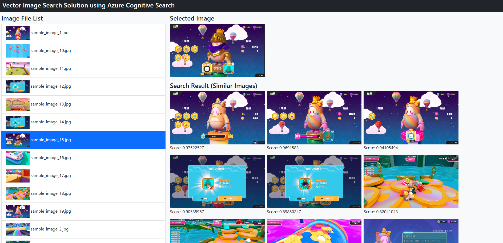

# Azure AI Search ベクトル検索での画像検索ソリューション

## 概要
- Keras の事前学習済みモデルの [EfficientNet モデル](https://www.tensorflow.org/api_docs/python/tf/keras/applications/efficientnet/EfficientNetB0)を使用して画像をベクトル化します
- ベクトル化した画像を Azure AI Search に格納して、[ベクトル検索](https://learn.microsoft.com/en-us/azure/search/vector-search-overview)できるようにします
- 検索クエリにベクトル化した画像を指定することで、似ている画像を検索できるようしています



## 必要な環境
- [Azure CLI](https://docs.microsoft.com/ja-jp/cli/azure/install-azure-cli)
- [Azure Bicep](https://docs.microsoft.com/ja-jp/azure/azure-resource-manager/bicep/install)
- [Python](https://www.python.org/downloads/)
- bash が実行できるコンソール (Windows だと [Git Bash](https://gitforwindows.org/) など)

## 利用方法

### Azure AI Search 環境の作成
必要な環境を用意し、設定(Azure CLI での Azure テナントへログインなど)を行った後に、以下の様に、第一引数にリソースグループ名を指定して [deploy.sh](./deploy.sh) スクリプトを実行して AI Search のアカウントを作成して、[cognitive_search_index.json](./cognitive_search_index.json) での定義に従ってインデックスを作成します。

```bash
./deploy.sh [リソースグループ名]
# 例： ./deploy.sh rg-image-vector-search
```

また、スクリプトは Python アプリが使用する AI Search アカウントの情報を持つ ```cognitive_search_account.json``` と HTMLアプリ(Vue.js) が使用する ```static/settings.js``` を出力します。

### Azure AI Search インデックスへのドキュメントの追加
Python の実行環境を用意します。[requirements.txt](requirements.txt) に記載した Python パッケージをインストールします。Python の仮想環境として venv を使用する場合、以下のコマンドで用意できると思われます。

```bash
python -m venv .venv
source .venv/Scripts/Activate # Windows + Git Bash 環境の場合
pip install -r requirements.txt
```

以下の通り、[upload_images.py](./upload_images.py) を実行することで、[static/images](./static/images)フォルダ配下にある JPG ファイルを [EfficientNet](https://www.tensorflow.org/api_docs/python/tf/keras/applications/efficientnet/EfficientNetB0) を使ってベクトル化して、AI Search のインデックスへドキュメントとして登録します。

```bash
python upload_images.py
```

### Web アプリケーションの起動
以下の通り、[app.py](./app.py) を実行することで、Web アプリケーションを起動することができます。

```bash
python app.py
```

```http://127.0.0.1:5000/```へアクセスすることで、Web アプリケーションへアクセスすることができます。画像を選択すると、AI Search に登録されている画像のうち似ている画像が画面に表示されます。
